# Instructions Of Create AR-Image Tracking with Swift.

### 1. first of All create new project XCode.

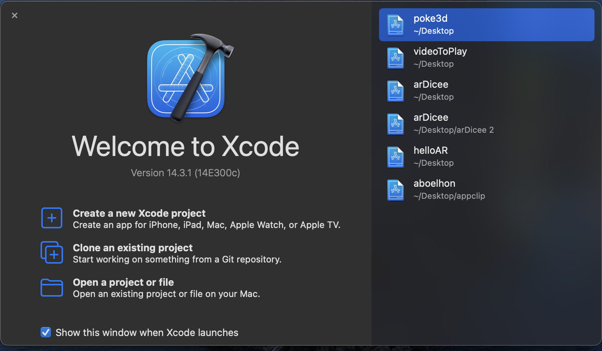

### 2. Choose Agumented Reality APP

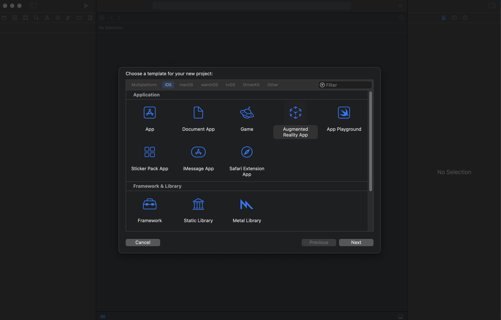

### 3. fill the form with your product name.
You should have a vaild Team, with permissions (**ADMIN**) in app store connect, just to have an ability to publish your porject.

For content Technology, you should choose **SceneKit**.

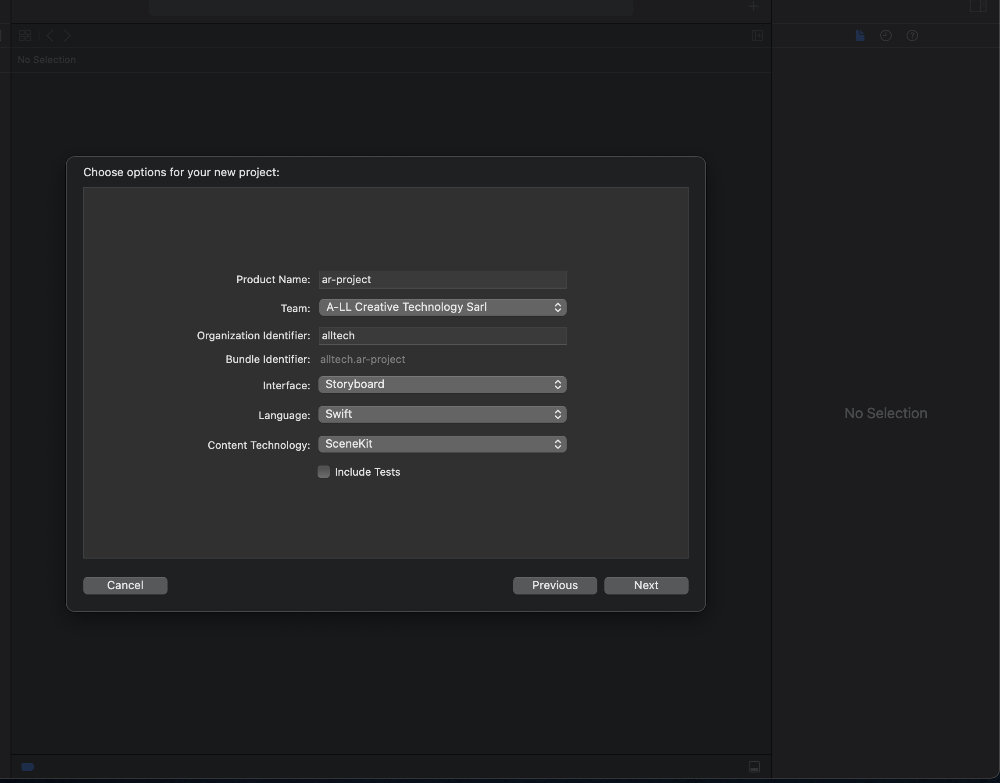

### 4. Good, now we have a new project, the first thing you should do now, go to the **art** directory and delete all content in this folder.

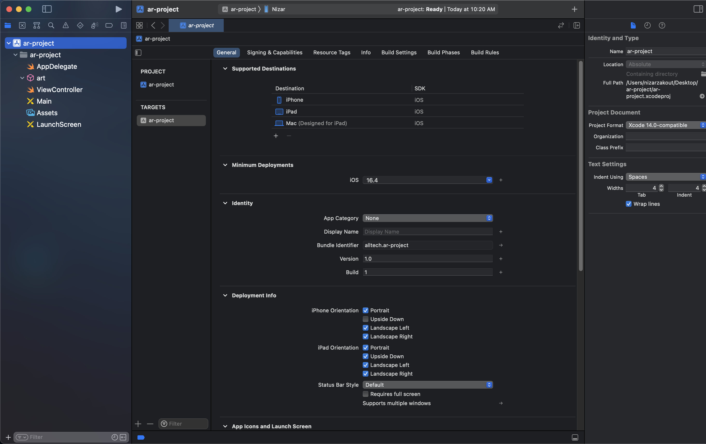

### 5. Now prepare the images you want to track, you should have a detailed image and good resoluiton.
#### Ensure you have an image with **PNG** extension.
In this tutorial we will use the following images to detect.

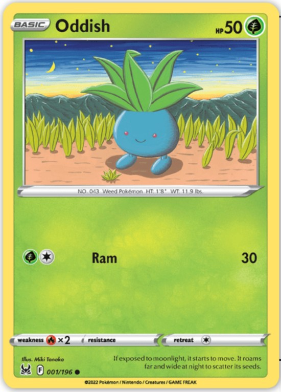
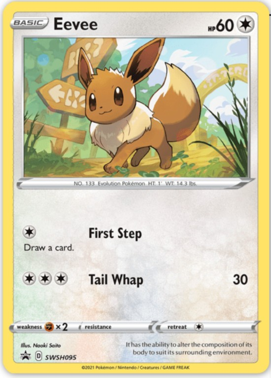

### 6. We should add our images to the project. 
For that go to **Assets** folder and below AppIcon, right click and choose **AR and Textures** then click on **New AR Resource Group** rename the Folder you created to **Pokemon Cards**.

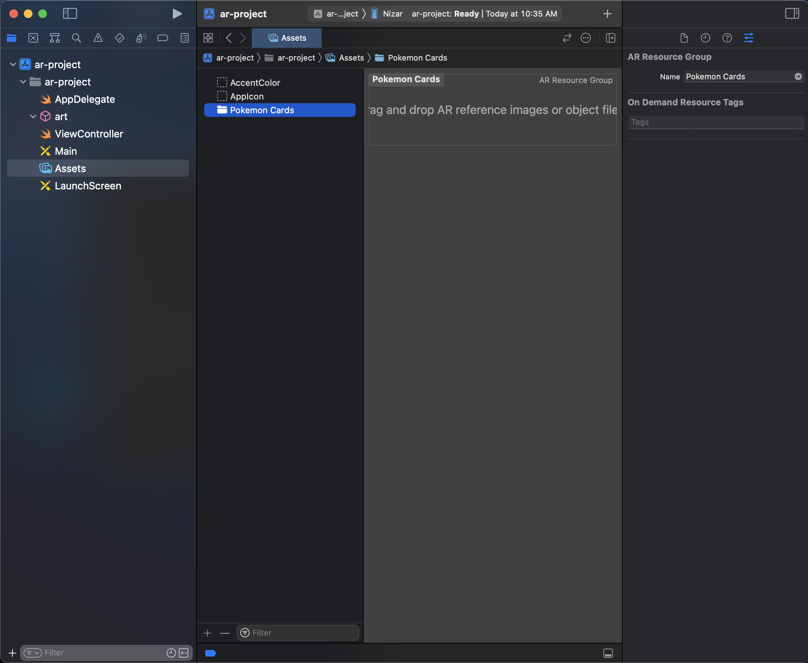

Now We should drag and drop our images in the Box. 

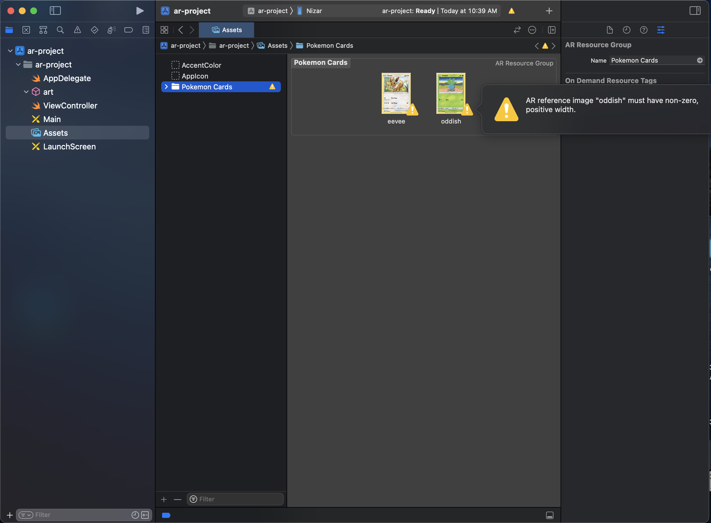

As you notice we have an Warning, Don't Worry, This because when we add new AR assets we must specify the width and height for it, so you should specify the width in meters, and the height calculated automatically based on the dimensions of the Image.

So in the right side bar you should edit the width... 

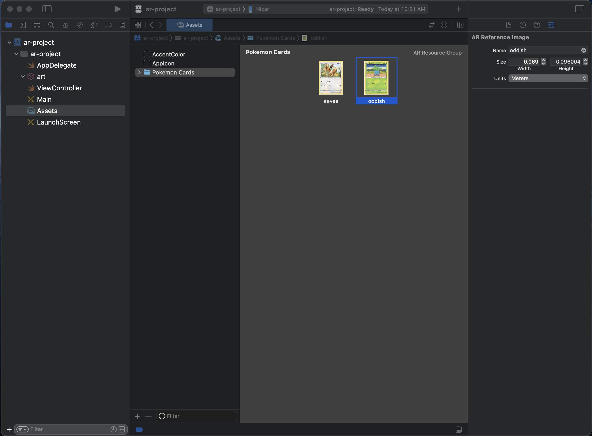

As you see the error disappered.

### 7. let's Code and add these assets in viewController.
a. in **the viewDidLoad()** function, **delete** the lines selected in the following image.

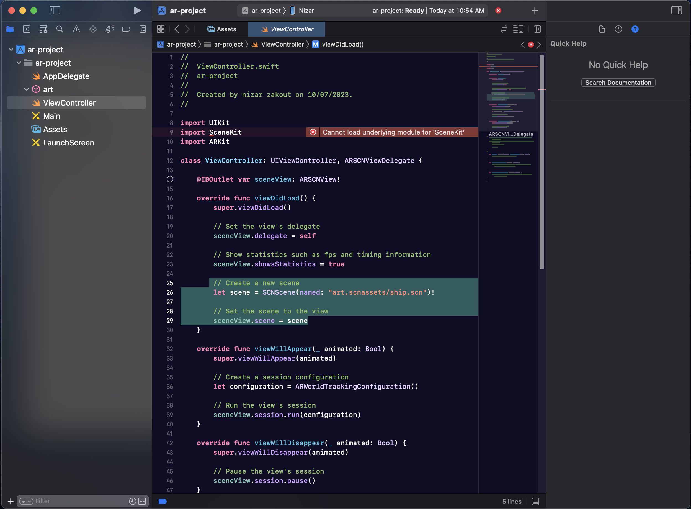

b. Now the time to tell our app where is the images to be tracking. That will be done in the **viewWillAppear()** function

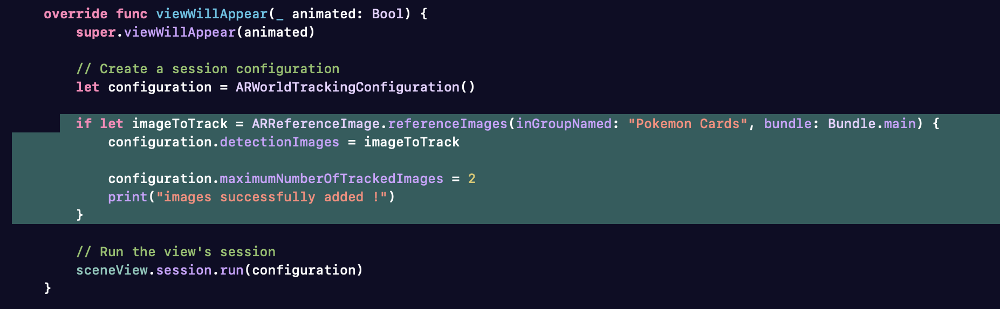

As you notice the **inGroupNamed** value equal the folder name where we put the images to Track, and the number of **Images to track is equal 2**.


#### Here is the Code.
```
 override func viewWillAppear(_ animated: Bool) {
        super.viewWillAppear(animated)
        
        // Create a session configuration
        let configuration = ARWorldTrackingConfiguration()
        
        if let imageToTrack = ARReferenceImage.referenceImages(inGroupNamed: "Pokemon Cards", bundle: Bundle.main) {
            configuration.detectionImages = imageToTrack
            
            configuration.maximumNumberOfTrackedImages = 2
        }

        // Run the view's session
        sceneView.session.run(configuration)
    }
    
```

### 8. How to add plane to our Card just to ensure we have good Tracking process.
a. First of all delete these lines of code. 

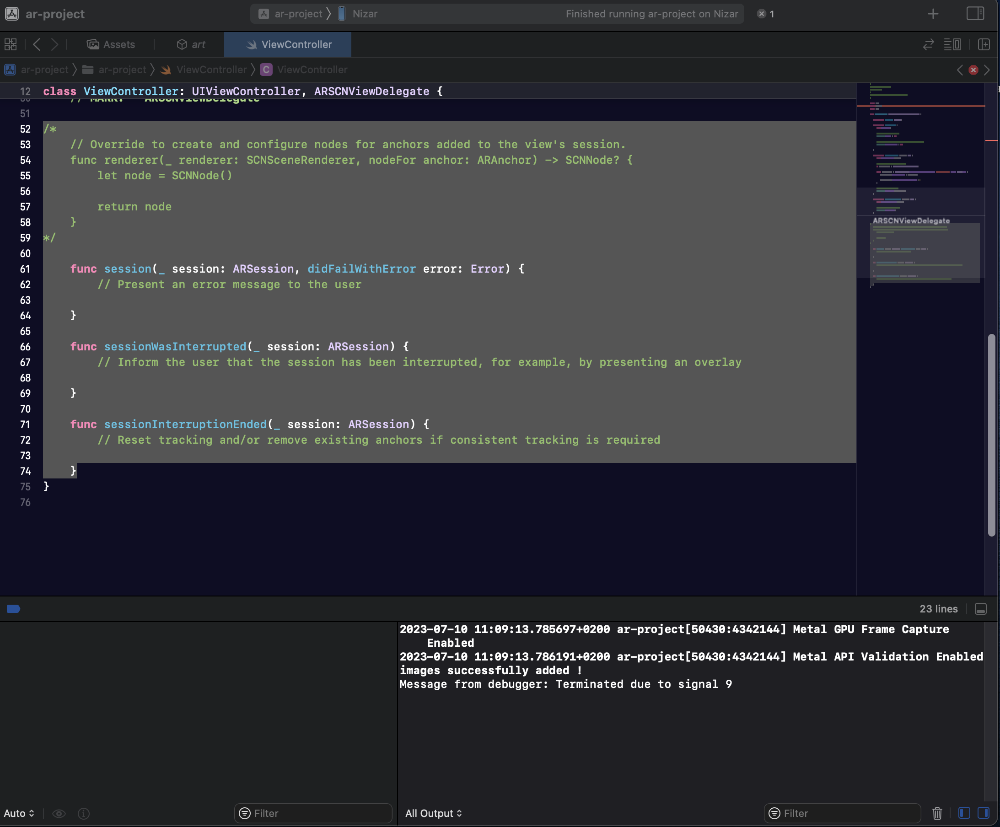

b. now right the renderer function in the same place.

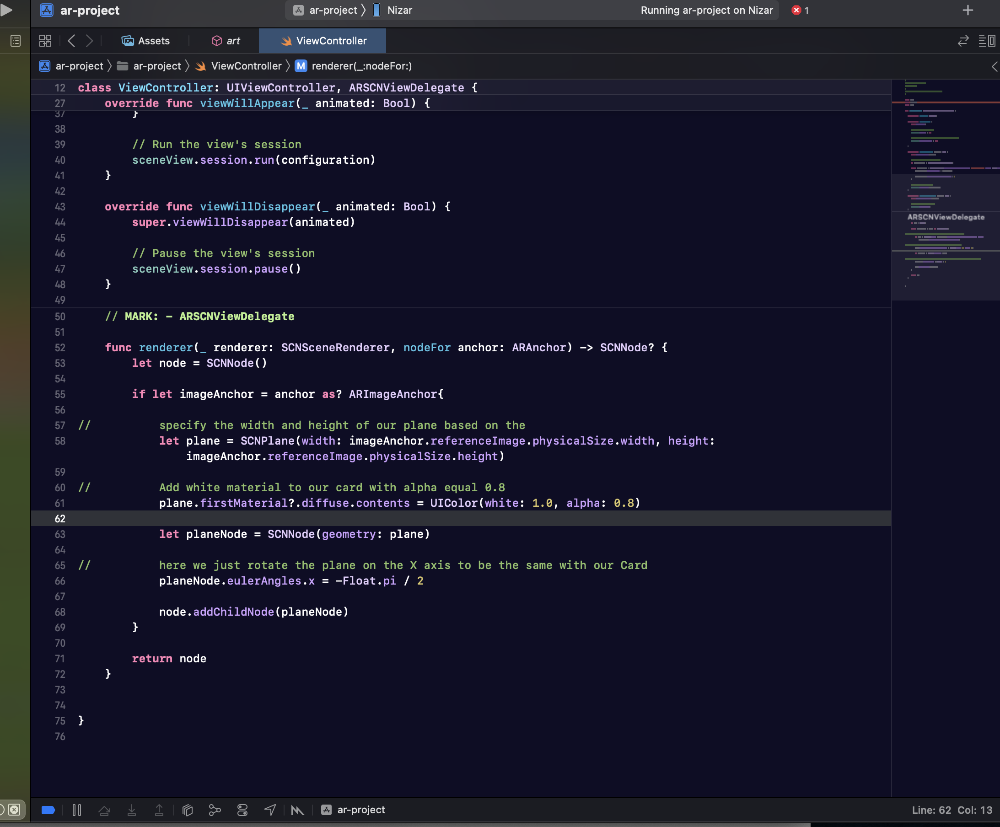

#### Here is the Code. 
```
  func renderer(_ renderer: SCNSceneRenderer, nodeFor anchor: ARAnchor) -> SCNNode? {
        let node = SCNNode()
        
        if let imageAnchor = anchor as? ARImageAnchor{
            
//          specify the width and height of our plane based on the
            let plane = SCNPlane(width: imageAnchor.referenceImage.physicalSize.width, height: imageAnchor.referenceImage.physicalSize.height)
            
//          Add white material to our card with alpha equal 0.8
            plane.firstMaterial?.diffuse.contents = UIColor(white: 1.0, alpha: 0.8)
            
            let planeNode = SCNNode(geometry: plane)
            
//          here we just rotate the plane on the X axis to be the same with our Card
            planeNode.eulerAngles.x = -Float.pi / 2
            
            node.addChildNode(planeNode)
        }
        
        return node
    }
    
```

If you build your app locally, you can check the if our app working very well!
#### here is the result, as you can see we have a white plane rendered above our CARD.


### 9. Add 3D models to *USDZ* file format.

a. Download these models USDZ format 

**[3D MODEL.USDZ-1 EEVEE](https://sketchfab.com/3d-models/eevee-pokemon-be609d949bc94e12a0add74c35ffa1b9#download)**
**[3D MODEL.USDZ-2 ODDISH](https://sketchfab.com/3d-models/oddish-in-a-flowerpot-pokemon-868cf7face2e49c3954ede36d0f40b34#download)**

b. Then drag and drop your models into **art** assets.


c. Now you should convert your objects and play with Scale and position as you want. 
> Check this **[Video](https://www.youtube.com/watch?v=if2jW_wO7K0)** please to know how to handle that.

d. Then Change the name instead of scene to **eevee** and **oddish**


e. In your **viewDidLoad()** function add **autoenablesDefaultLighting**

    sceneView.autoenablesDefaultLighting = true


f. Now you should add your object to the plane we create before.


### Your function RENDERER should be like this:-

```
    func renderer(_ renderer: SCNSceneRenderer, nodeFor anchor: ARAnchor) -> SCNNode? {
        
        let node = SCNNode()
        
        if let imageAnchor = anchor as? ARImageAnchor {
            
            let plane = SCNPlane(width: imageAnchor.referenceImage.physicalSize.width, height: imageAnchor.referenceImage.physicalSize.height)
            
            plane.firstMaterial?.diffuse.contents = UIColor(red: 1.0, green: 1.0, blue: 0.0, alpha: 0.5)
            
            let planeNode = SCNNode(geometry: plane)
            planeNode.eulerAngles.x = -Float.pi / 2
            
            node.addChildNode(planeNode)
            
            if imageAnchor.referenceImage.name == "eevee" {
                if let pokeScene = SCNScene(named: "art.scnassets/eevee.scn" ) {
                    if let pokeNode = pokeScene.rootNode.childNodes.first {
                        planeNode.addChildNode(pokeNode)
                    }
                }
            }
            
            if imageAnchor.referenceImage.name == "oddish" {
                if let pokeScene = SCNScene(named: "art.scnassets/oddish.scn" ) {
                    if let pokeNode = pokeScene.rootNode.childNodes.first {
                        planeNode.addChildNode(pokeNode)
                    }
                }
            }
        }
        
        return node
    }
    

```

**Finally Now we have AR with Swift !**
So Now we Should Start configure **[AppClip](https://github.com/Nizar7zak/Agumented-Reality-Swift-AppClip/blob/main/AppClip.md)** with our Application

