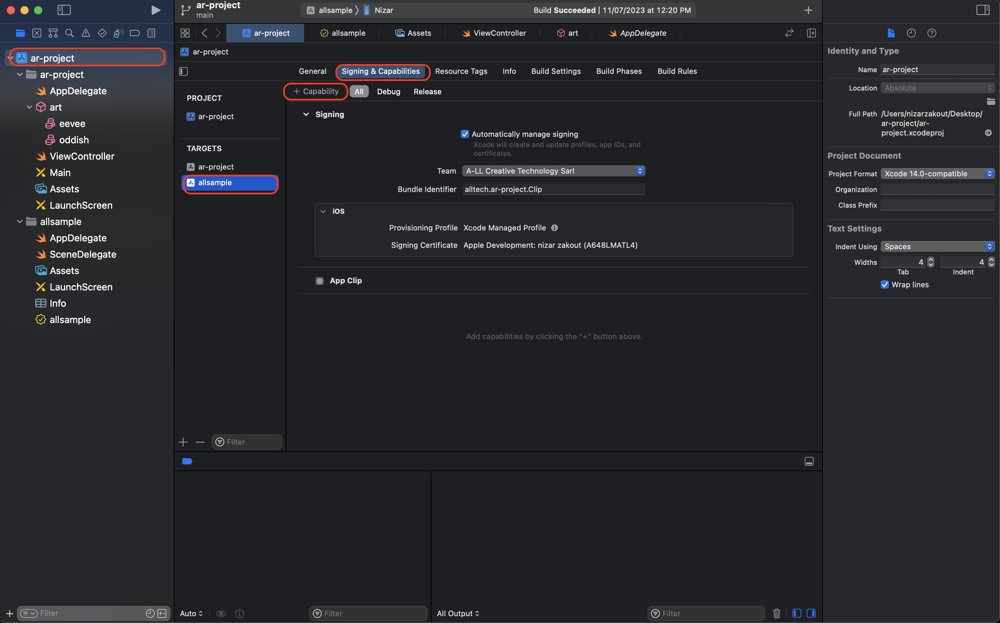

## Now we have Swift-app with Image tracking feature, also we configure our App Clip to open the part of our app, what we should now?

### 1. Add Associated Domain capability.

a. Open your project locally with xCode.
b. Then, please click into **+ Capability**



c. In the search bar, please write **Associated Domain** and double click to add it. As you see now we have the Domains Field.


d. Now we should add URL start with appClips: like this **appClips:r3f-ar.vercel.app** 

![]./screens/screenExp/3.png)

## So What this URL mean?
This URL **appClips:r3f-ar.vercel.app** is a web page hosting into LINK.
To allow our users open appClip from link, aslo to have local experince we want a JSON file call it `apple-app-site-association` this json file will contain:- 
```
{
    "appclips": {
        "apps": [
            "G6P7WD94KF.alltech.ar-project.Clip"
        ]
    }
}
```
```
"G6P7WD94KF.alltech.ar-project.Clip" => "AppleId.BundleIdentiferOfOurAppClip"
```

e. Then this JSON file will be in directory Called **.well-known** in the main root.


### 2. Local experience in Iphone.

a. Go to your mobile Settings.
b. Choose **Developer**
c. Choose Local experience.
d. Register Local Experience.


e. In the URL prefix you should have your Link of your website that contain our appClip JSON file.


f. If you want to generate QR CODE run this command in your CLI.
`AppClipCodeGenerator generate --url https://r3f-ar.vercel.app/ --index 9 --output Desktop/test.svg`

Now you can Scan your QR code and open app clip direct locally.